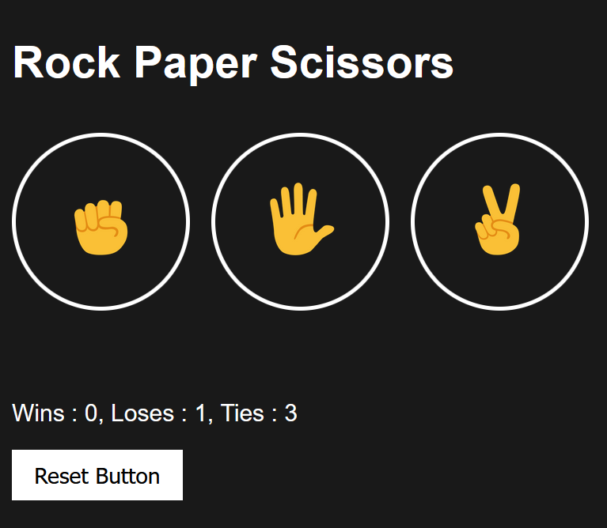

# Styled Rock Paper Scissors Game

This is a simple example of a Rock, Paper, Scissors game using base HTML, CSS, and JavaScript. You can create three buttons for the player to choose from (Rock, Paper, or Scissors), and then display the computer's choice and the result of the game.

## Features: 

### 1. Game won't reset even if the page refreshes.
### 2. Will show real time actions of computer and result.
### 3. Has changable features.

## I apologize if I made any mistakes, This is my first PR.